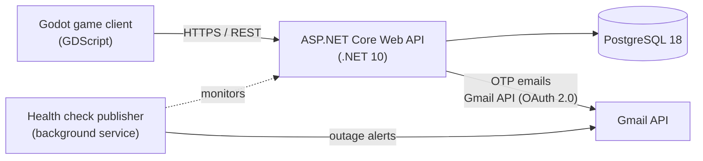

# 🍋 Lemons

An active tycoon game in the spirit of *Lemonade Tycoon* (2002): run a lemonade stand, manage your business, and grow your earnings. Lemons is built as a **Godot Engine** game client backed by a secure, containerized **ASP.NET Core** API and **PostgreSQL** database that handle accounts, sessions, and cloud saves.

## 📍 Project Status

| Component | Status |
| --- | --- |
| Backend API + database | **Live in production** on Railway |
| Godot client | Runs in the Godot editor against the local or production backend |
| iOS build | Planned: build and device testing still to do |
| App Store release | Planned |

## 🧩 How It Works

The game client never touches the database directly. All account and save data flows through the API, which handles authentication, encryption, and persistence.



- **Sign in with email + OTP:** Players register and log in with a one-time passcode sent by email. There are no passwords to forget, steal, or reset.
- **Automatic cloud saves:** The client saves your progress to the backend every 15 seconds.
- **One backend, two environments:** The same backend runs locally in Docker and in production on Railway.

## 🚀 Architectural Notes

- **Privacy-First Cryptography:** A multi-layered strategy shields data from database dumps and compliance leaks (blind indexing, AES-256 with distinct IVs, and SHA-256 hashing of credentials). See the cryptography section below.
- **OAuth 2.0 Email Delivery:** A Google Workspace OAuth 2.0 refresh token is used to obtain short-lived access tokens and send OTP and monitoring messages through the Gmail REST API over HTTPS, avoiding SMTP port dependencies.
- **Live Infrastructure Monitoring:** Native ASP.NET Core Health Checks expose a diagnostic route at `/health`. If the data channel or database socket is severed, the node signals health degradation.
- **Autonomous Outage Alerting:** A background `IHealthCheckPublisher` tracks system stability every few seconds. If a critical service goes offline, it immediately emails detailed crash information to the administration team through the Gmail REST API.
- **Unified API Error Contract (RFC 7807):** API errors use the standard `ProblemDetails` response. The Godot client uses a single centralized function to parse any server-side validation or security error.
- **Client UI Lockout State Machine:** A centralized async network tracker in the Godot client freezes input controls while HTTP requests are active, eliminating double-click bugs and value spam.
- **IP-Partitioned Rate Limiting:** Fixed-window gateway middleware protects the authentication endpoint from credential brute-forcing and automated OTP request spam.
- **Autonomous Database Sweeping:** An asynchronous .NET Hosted Service automatically purges abandoned OTP tokens and inactive sessions every 24 hours.
- **Container DevOps:** Multi-stage Docker builds and software-defined isolated sub-networks compatible with the Postgres 18 data directory layout. The production stack is deployed through Railway.

## 🛠️ Technology Stack

| Layer | Technology |
| --- | --- |
| Game client | Godot Engine (GDScript) |
| Backend API | C# (.NET 10 Web API) |
| Database | PostgreSQL 18 (container volume) |
| Authentication email | Google Workspace Gmail API (OAuth 2.0, HTTPS / port 443) |
| Deployment | Docker / Docker Compose / Railway |

## 🔒 Cryptographic Implementation

### 1. User Identity Obfuscation (Deterministic Hashing)

To avoid storing player emails in plain text, the backend normalizes each email and passes it through `HMAC-SHA256` with a secure server-side pepper key. This acts as a cryptographic "blind index," enabling fast direct table lookups while keeping email addresses masked.

### 2. PII Data Privacy (Reversible AES-256 Encryption)

Sensitive profile data, such as custom player profile names, is encrypted with `AES-256` in Cipher Block Chaining (CBC) mode before it is written to PostgreSQL. A unique random Initialization Vector (IV) is prefixed to each output block, so identical inputs produce different ciphertext across rows.

### 3. Verification & Session Credentials (One-Way Hashing)

Short-lived credentials, including randomly generated 6-digit one-time passcodes and user session tokens, are hashed with `SHA-256`. The server never stores plain-text OTPs or session tokens, and raw credentials exist only for the duration of the active client request.

## 📁 Repository Layout

```
Godot-Lemons/
├── Backend/                    # ASP.NET Core Web API (C#)
├── lemon_frontend/             # Godot project (game client)
├── docker-compose.example.yml  # Template for the local backend stack
└── README.md
```

## 📦 Local Installation & Deployment Guide

Follow these steps to run the full backend locally.

### 1. Clone the repository

```bash
git clone https://github.com/ShivBDev/Godot-Lemons.git
cd Godot-Lemons
```

### 2. Configure environment parameters

Copy the template composition file and name it `docker-compose.yml`:

```bash
cp docker-compose.example.yml docker-compose.yml
```

Open `docker-compose.yml` and fill in the required settings, including the Google Workspace Gmail address and the OAuth 2.0 client credentials and refresh token used by the backend email service.

### 3. Launch the containers

```bash
docker compose up --build -d
```

Verify that the containers are running and healthy:

```bash
docker ps
```

### 4. Run the Godot client

Open the `lemon_frontend/` folder in the Godot Editor and run the main network scene. The client talks to the local backend at `http://127.0.0.1:5212`: you can register with email, receive an OTP through the Gmail API, and play with automatic saves every 30 seconds.

The same backend is configured for cloud deployment on Railway.

## 🗺️ Roadmap

- [ ] Build and test the client on iOS devices
- [ ] Release on the App Store
